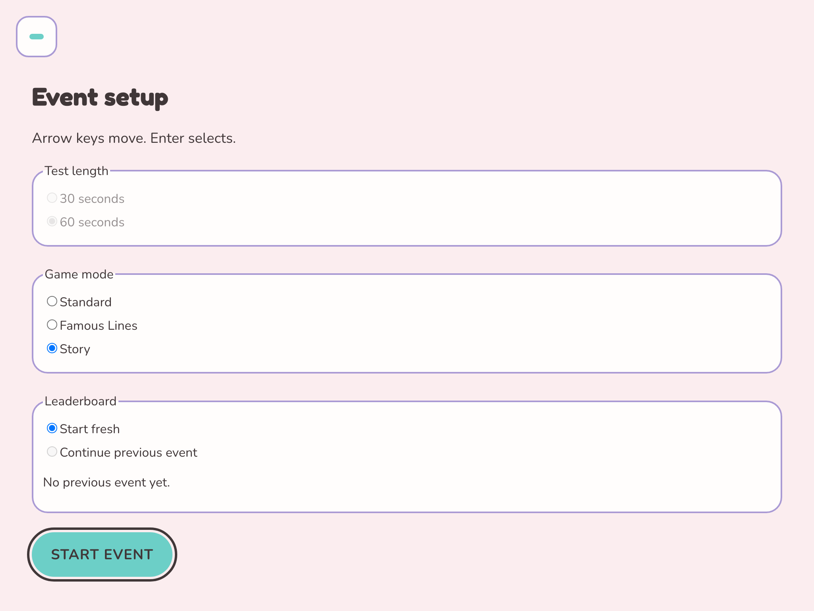
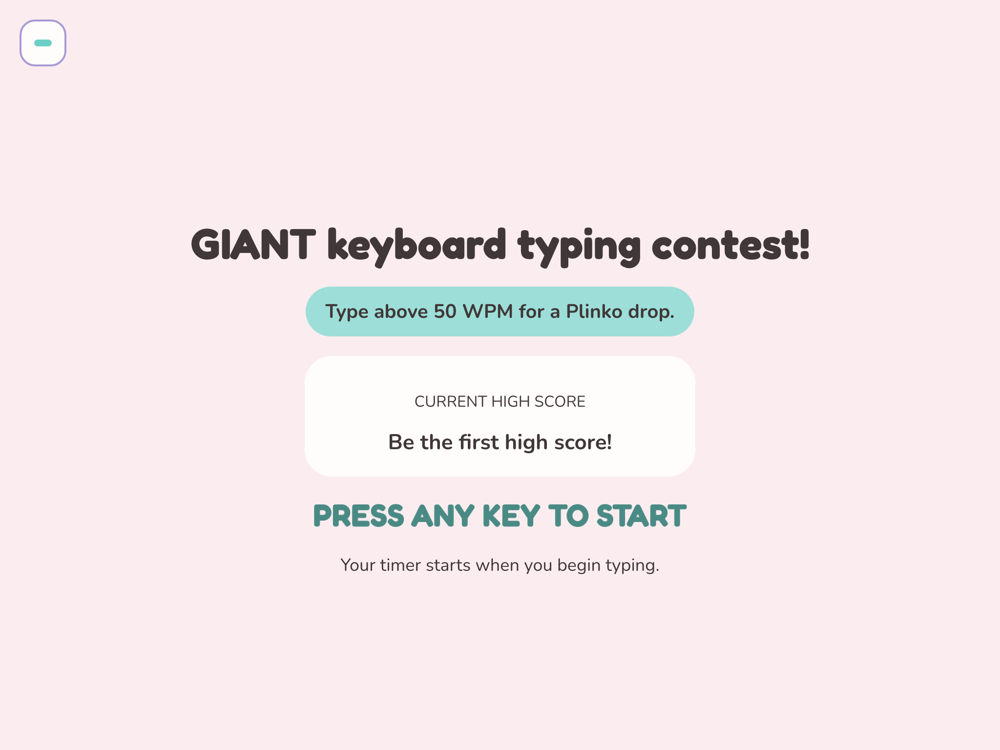
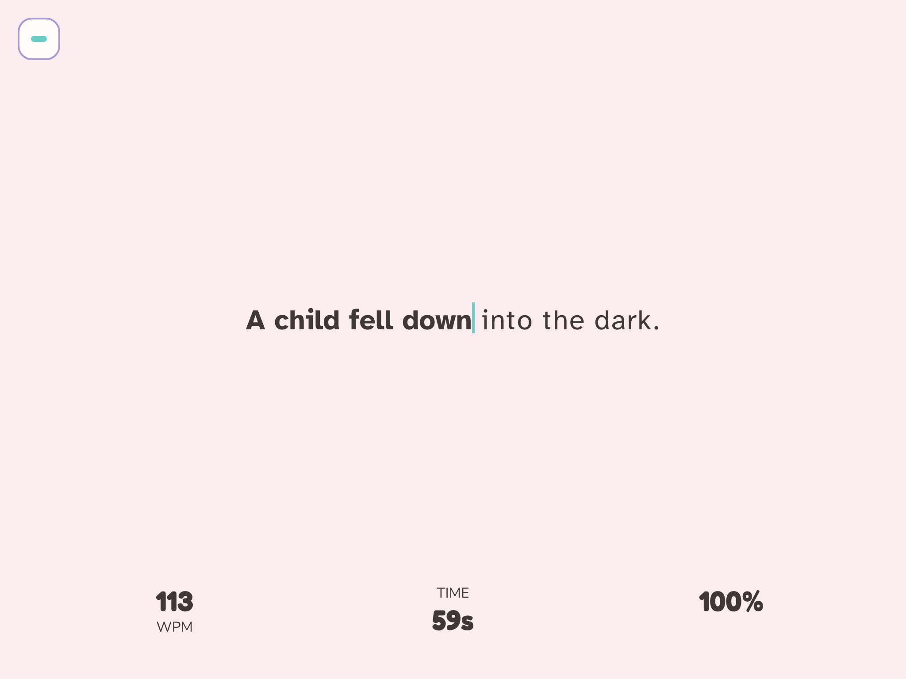
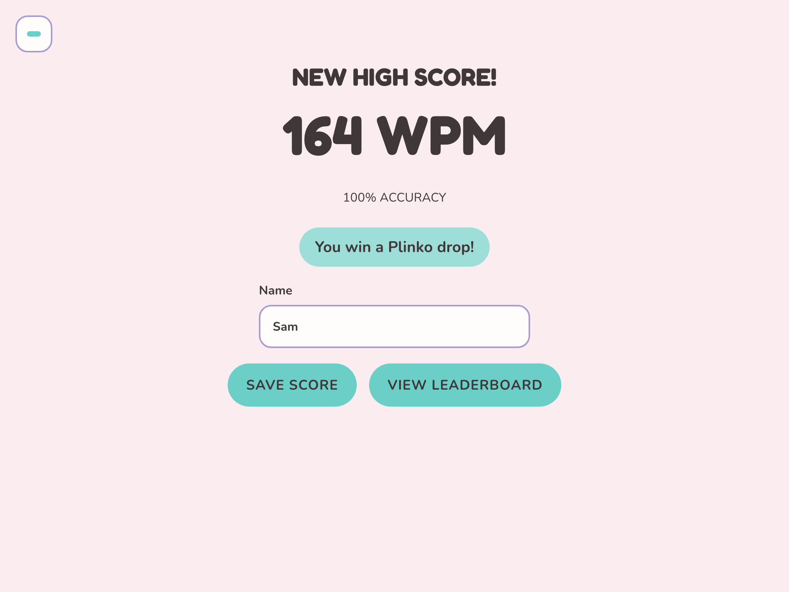
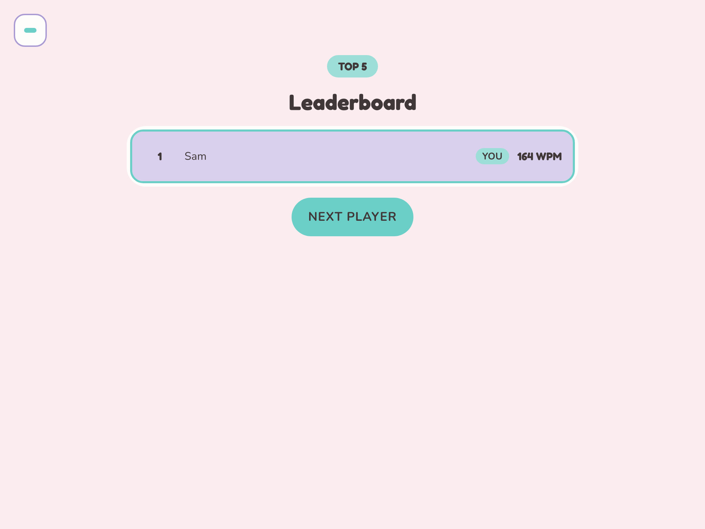

# clickclackchallenge

An offline typing contest for a landscape iPad and a giant physical keyboard. It is built for repeated use at an event booth: one contestant finishes, the leaderboard shows, and the next person can start without a refresh.

Scores stay on the device in IndexedDB. After the app is installed from a public HTTPS URL, the booth loop works with no network.

Play it at [clickclackchallenge.vercel.app](https://clickclackchallenge.vercel.app/). Use a landscape window at full screen.

## Demo

The five booth screens, in order, on the 4:3 stage.



**Event Setup.** The operator chooses the length, the mode, and whether the leaderboard continues. Story uses 60 seconds.



**Ready.** Any key except Escape starts the test. That opening key is not scored.



**Typing.** The passage, live WPM, accuracy, and the time remaining.



**Results.** A Top 20 score at 70% accuracy or better can enter a name. Displayed WPM above 50 wins a Plinko drop.



**Leaderboard.** The event Top 5, then the next player.

## Booth loop

1. **Event Setup.** The operator chooses 30 or 60 seconds, a game mode, and either Start fresh or Continue previous event. Arrow keys move. Enter selects. Story always uses 60 seconds.
2. **Ready.** Any key except Escape starts the test. That opening key is not scored.
3. **Typing.** The first valid typing key starts the timer. The screen shows the passage, live WPM, accuracy, and time remaining.
4. **Results.** The contestant sees WPM and accuracy. A qualifying Top 20 score can enter a name.
5. **Leaderboard.** The event Top 5 is shown, then the app returns to Ready.

Game modes are Standard, Famous Lines, and Story. A score keeps the length, mode, and WPM from the attempt that earned it. Story ends when the last sentence is finished, and that WPM uses the time it took. The 60-second timer still ends a slow attempt.

### Scoring and names

A score can rank when its accuracy is at least 70% and its displayed WPM is at least 1. The gate uses the stored percentage, so 69.99% does not qualify even though it displays as 70%. The threshold is provisional until it is checked on the giant keyboard.

Displayed WPM above 50 wins a Plinko drop. That line is separate from ranking.

Name entry is shown for a score that passes the gate, displays at least 1 WPM, and ranks 20th or better. Enter saves the typed name. An empty or blocked name waits 15 seconds, shows “Opening the leaderboard in {n}s” for the last 5 seconds, then stores the score with no name. After the last change to an allowed name, the screen waits 20 seconds, shows “Saving your score in {n}s” for 5 seconds, and saves that name. Another change restarts the 20 seconds.

Full rules are in [docs/prd.md](docs/prd.md).

### Keys

| Action | Result |
| --- | --- |
| Hold Escape on Ready, Typing, Results, or the rolling high-score list | Open Event Setup. An unsaved attempt is discarded. The active event stays. |
| Short Escape on Ready | Stay on Ready. The test does not start. |
| Short Escape while typing | Return to Ready. No score is saved. |
| Short Escape on Results with a name field | Stay on Results. The name is not saved. |
| Enter, Space, or Escape on Results with no name field | Open the leaderboard and store one score with no name. |
| Space, Enter, or Escape on the Leaderboard | Return to Ready. Saved scores stay. |
| Any key on the rolling high-score list | Return to Ready. That key does not start the test. |

A long-press on the logo opens Event Setup from Ready, Typing, Results, and the Leaderboard.

## Stack

| Piece | Role |
| --- | --- |
| React 19 and TypeScript | The interface |
| Vite 8 | Dev server and production build |
| IndexedDB through `idb` | Scores stored on the device |
| `vite-plugin-pwa` | The installable offline app |
| Vitest and oxlint | Tests and lint |
| Fredoka, Nunito, Atkinson Hyperlegible | Display, interface, and typing type |

There is no backend and no environment variables. Node.js 22 is required (`.nvmrc`).

## Run locally

```bash
nvm use
npm install
npm run dev
```

Open the printed `http://localhost` URL and walk the loop in the demo above. `localhost` is a secure page, so scores can be saved. A plain `http://` address on the local network is not, and starting an event there fails.

`npm run dev` does not register the service worker. Use a production build to try install and offline behavior.

## Scripts

| Command | What it does |
| --- | --- |
| `npm run dev` | Start the Vite dev server |
| `npm run build` | Typecheck and build the static app into `dist` |
| `npm run preview` | Serve the production build locally |
| `npm test` | Run the Vitest suite |
| `npm run lint` | Run oxlint |

## Deploy

Deploy the `main` branch. The site must be served from the domain root over HTTPS.

On Vercel:

- Framework preset: Vite
- Build command: `npm run build`
- Output directory: `dist`
- Install command: `npm install`
- Environment variables: none

Netlify and Cloudflare Pages use the same build command and output directory. Do not deploy to a path such as `/clickclackchallenge/`. The service worker and manifest expect `/`.

The live site is [clickclackchallenge.vercel.app](https://clickclackchallenge.vercel.app/). Open it, let the app finish loading, and use that URL for the booth. Later pushes to `main` update the same site.

## Documentation

Each topic has one owner. The README does not restate those rules.

| Document | What it owns |
| --- | --- |
| [Product requirements](docs/prd.md) | Scoring, the accuracy gate, ranking, names, persistence, offline behavior, and booth acceptance tests |
| [Technical plan](docs/technical_plan.md) | Stack, application state, IndexedDB, the service worker, and the automated test map |
| [Design system](docs/design_system.md) | Palette, type, tokens, and contestant-facing strings |
| [Wireframes](docs/wireframes.md) | Screen layout and the five screen PNGs |

## License

No license has been selected yet.

Until a license is added, this repository does not grant reuse of the source or project assets. If the project is made public, add an explicit license only after deciding how the specification, future code, and any branding or assets may be used.
