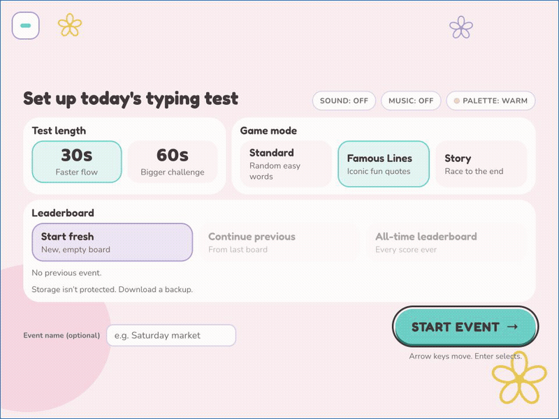
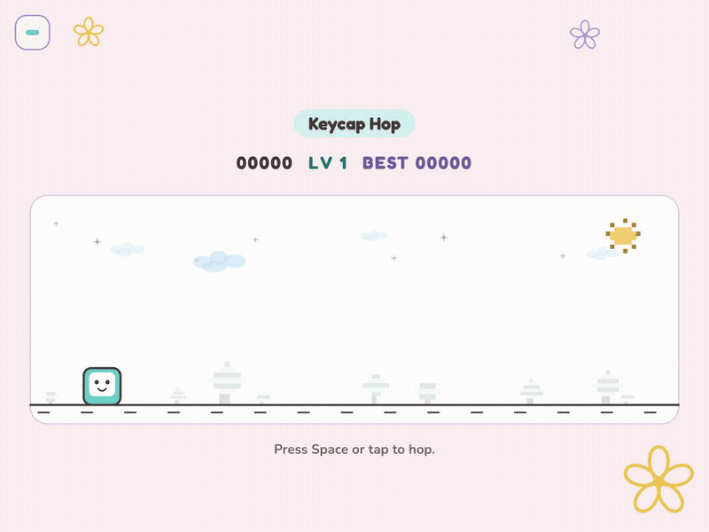
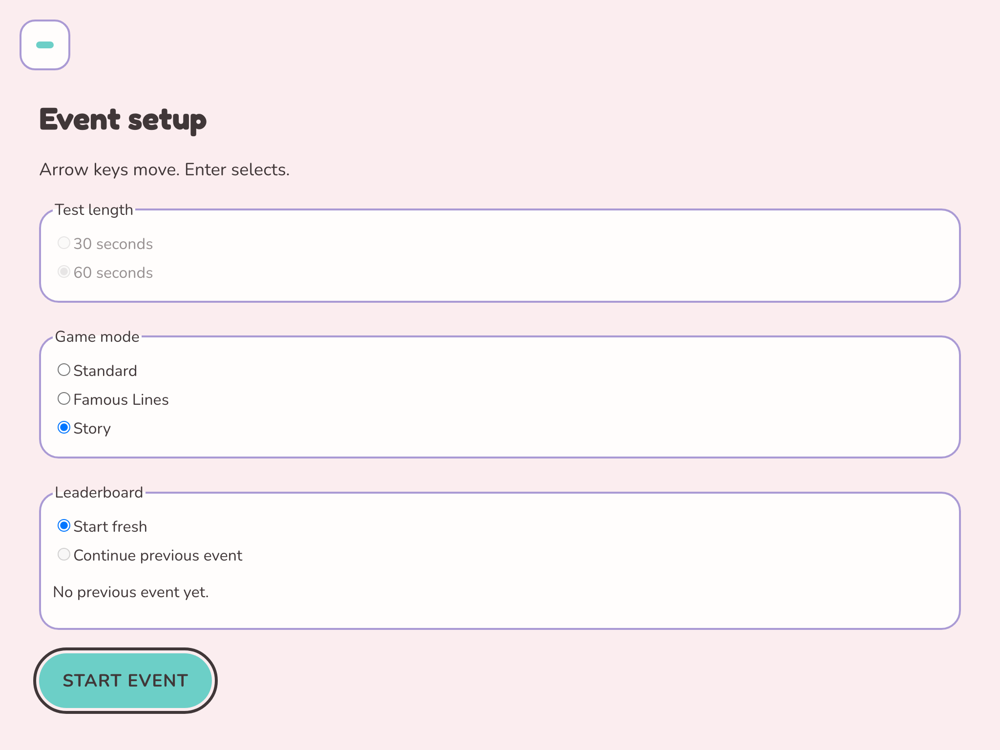
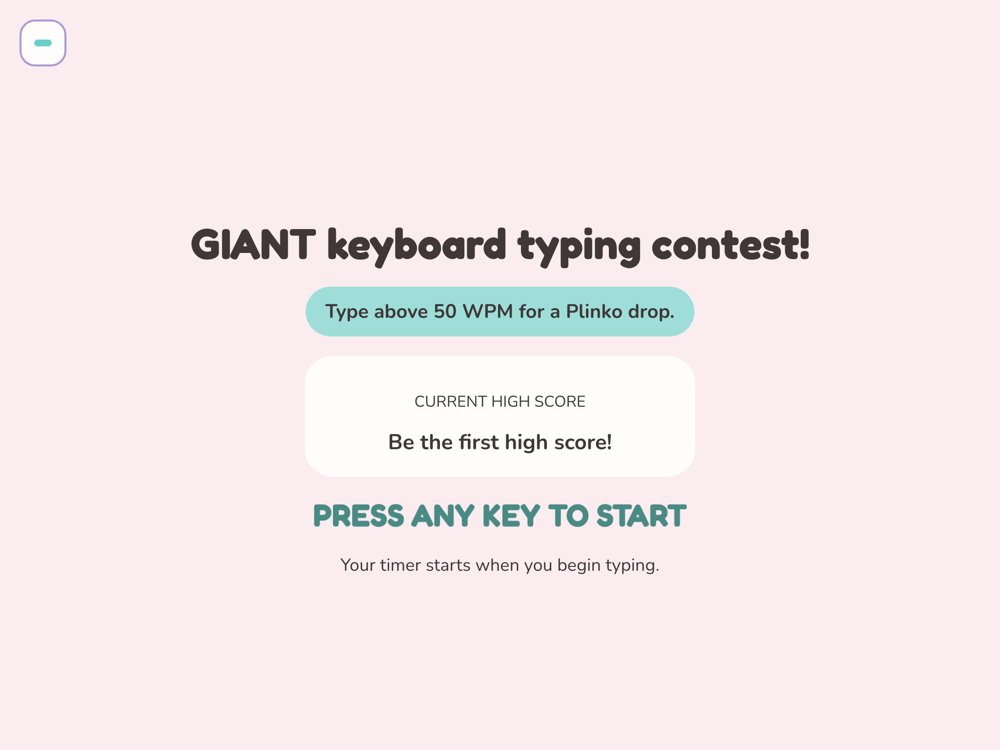
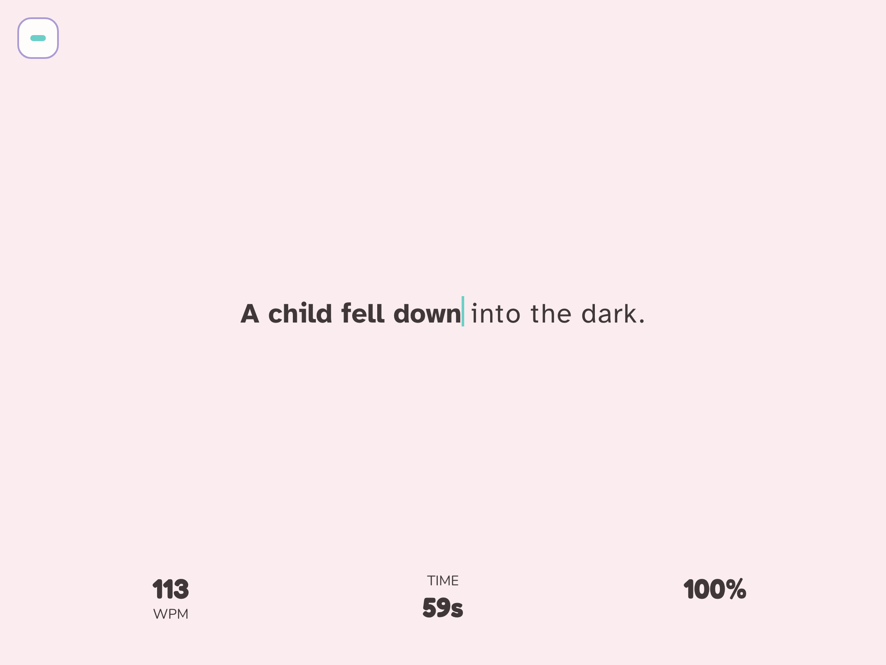
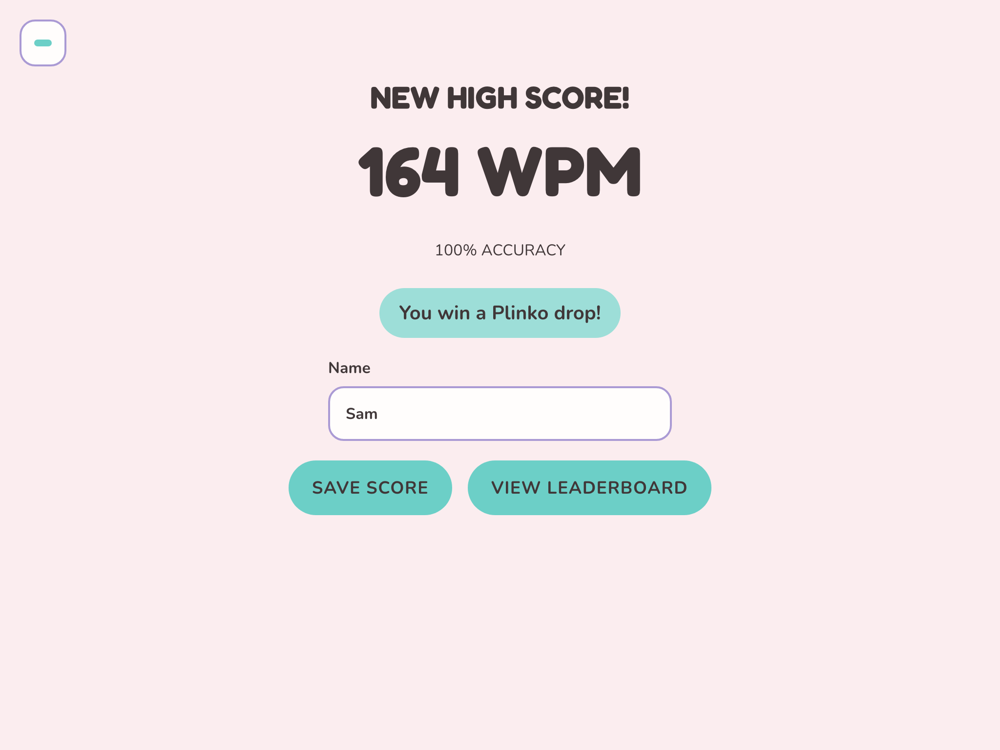
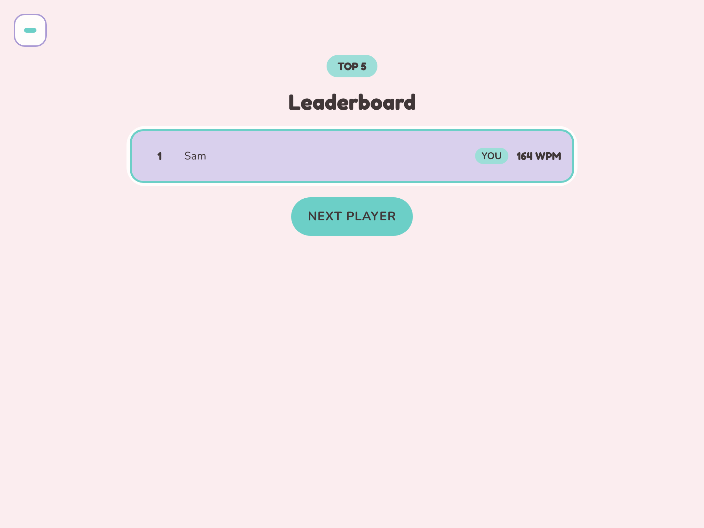

# clickclackchallenge

[](https://github.com/heykatie/clickclackchallenge/actions/workflows/checks.yml)

**An offline-ready typing contest for event booths.** Built for a landscape iPad and a giant physical keyboard, clickclackchallenge guides each player from a timed typing round to a saved score and the next player—without refreshing the app.

[**Try the live demo**](https://clickclackchallenge.vercel.app/) · [Product requirements](docs/prd.md) · [Technical plan](docs/technical_plan.md)

## See it in action

These short recordings show the real app in motion. Use the live demo to try the interactions.

<p align="center"></p>
<p align="center"><strong>Booth flow:</strong> event setup through live typing stats.</p>

<p align="center"></p>
<p align="center"><strong>Keycap Hop:</strong> optional runner gameplay, shown after the Easter egg opens.</p>

Five screenshots below show the individual booth screens in more detail.

<table>
  <tr>
    <td align="center" width="50%"></td>
    <td align="center" width="50%"></td>
  </tr>
  <tr>
    <td align="center"><strong>Set up an event</strong></td>
    <td align="center"><strong>Welcome the next player</strong></td>
  </tr>
  <tr>
    <td align="center" width="50%"></td>
    <td align="center" width="50%"></td>
  </tr>
  <tr>
    <td align="center"><strong>Track the round live</strong></td>
    <td align="center"><strong>Save a qualifying score</strong></td>
  </tr>
  <tr>
    <td align="center" colspan="2"><br><strong>Show the leaderboard and hand off to the next player</strong></td>
  </tr>
</table>

## What it does

- Runs 30- or 60-second contests in Standard, Famous Lines, or Story mode.
- Starts the timer on the first valid character, then scores the round by WPM and accuracy.
- Keeps events and scores on-device in IndexedDB, with fresh, continued, and all-time leaderboards.
- Works offline after the app is installed from its HTTPS deployment.
- Gives a Plinko drop for a qualifying score above 50 WPM.
- Hides **Keycap Hop**, an optional runner with obstacles and power-ups, as an Easter egg in the booth experience.
- Supports keyboard-first operation and responsive layouts for the booth display and browser windows.

Keycap Hop is separate from the contest: it does not save scores or affect the leaderboard. Its physics, obstacle spacing, difficulty, and power-ups are covered by the testable game simulation.

## Engineering highlights

- **Reliable booth flow:** event setup, typing, results, score entry, leaderboard, and next-player handoff are managed without a page refresh.
- **Local-first persistence:** IndexedDB stores event settings and scores; no backend or runtime secrets are required.
- **Installable offline app:** Vite builds the static app and service worker for root-hosted HTTPS deployment.
- **Game simulation:** the optional Hop Easter egg keeps its physics, obstacle spacing, difficulty, and power-ups in a testable simulation module.
- **Verification:** Vitest covers scoring, persistence, keyboard flows, and game behavior; oxlint checks the code.

## Run locally

Node.js 22 is required (`.nvmrc`).

```bash
nvm use
npm install
npm run dev
```

Open the local URL printed by Vite. The development server skips service-worker registration; use a production build to verify installation and offline behavior:

```bash
npm run build
npm run preview
```

## Scripts

| Command | Purpose |
| --- | --- |
| `npm run dev` | Start the development server |
| `npm run build` | Type-check and build the app into `dist` |
| `npm run preview` | Serve the production build locally |
| `npm test` | Run the Vitest suite |
| `npm run lint` | Run oxlint |

## Project docs

- [Product requirements](docs/prd.md): scoring, ranking, persistence, offline behavior, and booth acceptance criteria.
- [Technical plan](docs/technical_plan.md): application state, IndexedDB, service worker, and test map.
- [Design system](docs/design_system.md): visual tokens, type, and interface copy.
- [Wireframes](docs/wireframes.md): screen layouts and references.

## License

This public repository has no license file. Please ask before reusing its code or assets.
