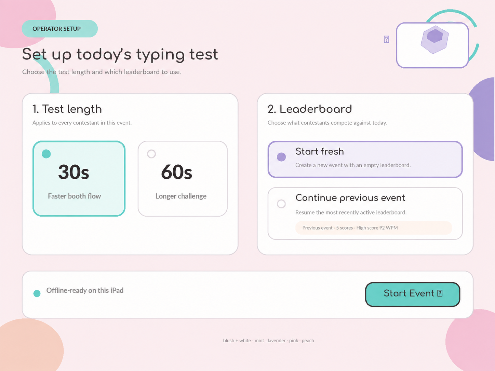
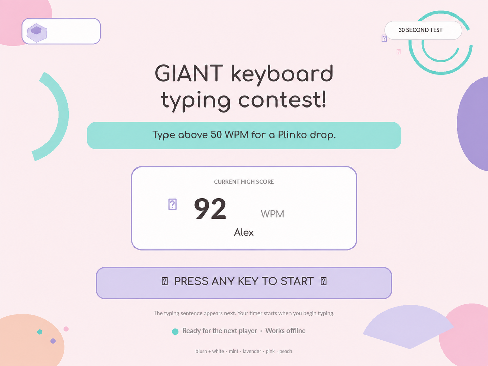
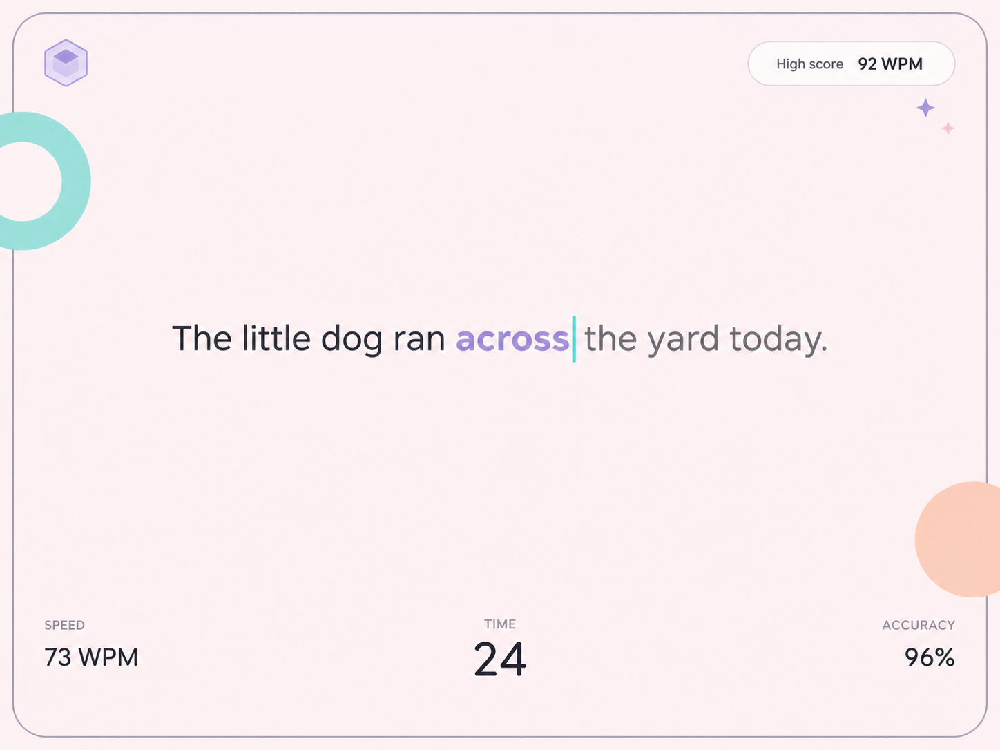
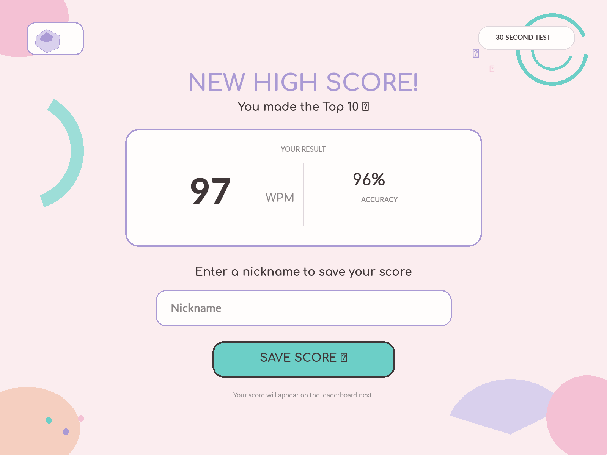
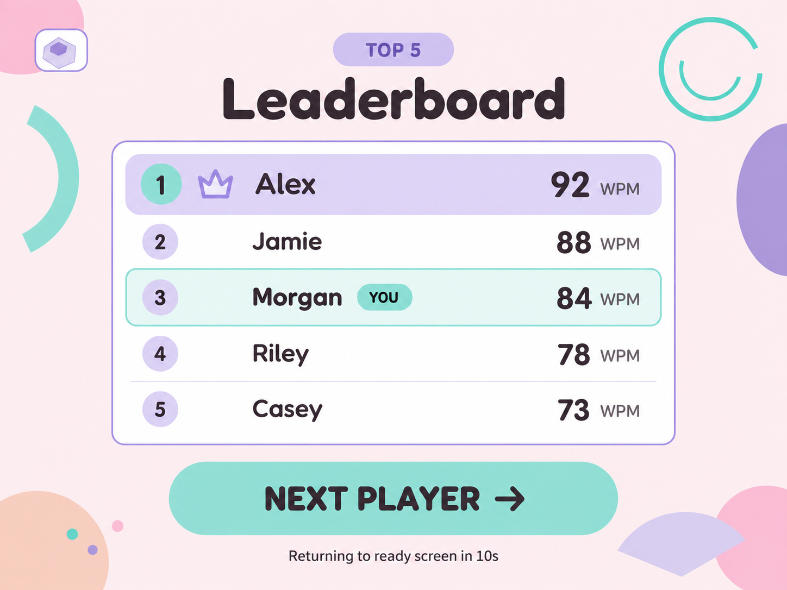

# Typing Test — V1 Wireframes

This file owns screen layout and the five PNG wireframes in `docs/wireframes/`.

## Document ownership

Each fact has one owner. Other documents link to that owner instead of restating the rule.

| Topic | Owner |
| --- | --- |
| Scoring, accuracy gate, ranking, nickname rules, continue-event duration, reset timing, what must persist, offline must-work | `docs/prd.md` |
| Palette, type scale, CSS tokens, motifs, component styling, required contestant-facing strings | `docs/design_system.md` |
| Screen layout and the five PNG wireframes | `docs/wireframes.md` |
| Stack, application state, IndexedDB schema, module boundaries, service worker, precache, navigation fallback, implementation order | `docs/technical_plan.md` |
| Booth acceptance tests and the pre-event checklist | `docs/prd.md` |
| Automated test map and hardware check lists | `docs/technical_plan.md` |

If two documents disagree, follow the owner in this table. The user's latest explicit instruction still takes priority over every document.

This document specifies the five-screen experience for an offline typing contest on a giant physical keyboard, displayed on a landscape iPad. It describes the intended interface; application behavior has not been verified against running code in this workspace.

**Target:** landscape iPad, 4:3, readable from approximately two feet away. Each contestant screen fits within the viewport without scrolling.

**Current branding rule:** preserve the brand inspired pastel visual style and optional logo-only keycap badge.

## 1. References and interpretation

- Product behavior comes from `docs/prd.md` and `docs/technical_plan.md`. Visual layout comes from this document and `docs/design_system.md`.
- Later decisions replace older examples: blush/white replaces the cream-led palette; Ready has a keyboard prompt and current high score, with no Start button or leaderboard; the passage is a complete centered single line; shop-name text is removed.
- Current PNG exports for all five screens are tracked in `docs/wireframes/`. Each is 4:3. Export pixels are not CSS layout dimensions.
  - Event Setup: [01-setup.png](./wireframes/01-setup.png), 1448 × 1086
  - Ready: [02-ready.png](./wireframes/02-ready.png), 1448 × 1086
  - Typing: [03-typing.png](./wireframes/03-typing.png), 1448 × 1086
  - Results: [04-results.png](./wireframes/04-results.png), 1600 × 1200
  - Leaderboard: [05-leaderboard.png](./wireframes/05-leaderboard.png), 1448 × 1086
- Names, scores, accuracy values, and selected options in examples are sample data. They are not seeded event records or confirmed defaults.
- Details marked **Proposed** complete a gap in the wireframe specification. Unresolved product decisions are collected in section 11.

## 2. Screen flow

```text
EVENT SETUP
    │ Start Event
    ▼
READY / ATTRACT ◄────────────────────────────────────────────┐
    │ Press any key                                         │
    ▼                                                       │
TYPING — waiting for first typing input                      │
    │ First valid typing keystroke starts the timer          │
    ▼                                                       │
TYPING — running                                            │
    │ Selected duration expires                             │
    ▼                                                       │
RESULTS + NICKNAME                                          │
    │ Top 10: nickname entry and Save Score                  │
    │ Other results: continue without nickname entry        │
    ▼                                                       │
TOP 5 LEADERBOARD                                           │
    └── Next Player or automatic reset ─────────────────────┘
```

There are five screens. Waiting and running are states of Typing; nickname entry is part of Results, not a sixth screen. Event Setup is for the operator and does not repeat between contestants.

| Transition | Required behavior |
| --- | --- |
| Setup → Ready | Create or resume the event and apply its settings. |
| Ready → Typing | Show the whole sentence; consume the opening keypress without entering it into the passage or starting the timer. |
| Waiting → Running | Start timing on the first valid typing keystroke. |
| Running → Results | End the test at the selected duration and show final WPM, accuracy, and qualification status. |
| Results → Leaderboard | Let eligible players save a nickname; all contestants can proceed to the Top 5. The non-qualifier control is proposed in section 7. |
| Leaderboard → Ready | Clear contestant state, retain event data, and return without refreshing the browser. |

## 3. Shared visual system

Palette, type scale, CSS tokens, corner radii, and touch-target sizes live in `docs/design_system.md`. Use those values instead of sampling colors from the PNGs. Words inside the diagrams show placement. The canonical strings live in the design system brand-voice section.

## 4. Screen 01 — Event Setup

**Purpose:** let the operator select the test length and choose whether to start a new event or resume the most recently active event.



```text
┌──────────────────────────────────────────────────────────────────┐
│ OPERATOR SETUP                                      [logo only]   │
│ Set up today's typing test                                       │
│ Choose the test length and which leaderboard to use.             │
│                                                                  │
│ ┌────────────────────────┐  ┌─────────────────────────────────┐  │
│ │ 1. Test length         │  │ 2. Leaderboard                  │  │
│ │                        │  │                                 │  │
│ │ [● 30 seconds]         │  │ [● Start fresh]                 │  │
│ │ [○ 60 seconds]         │  │ Create a new event.             │  │
│ │                        │  │                                 │  │
│ │ Applies to everyone    │  │ [○ Continue previous event]     │  │
│ │ in this event.         │  │ Resume the latest event.        │  │
│ └────────────────────────┘  └─────────────────────────────────┘  │
│                                                                  │
│                                           [ START EVENT ]        │
└──────────────────────────────────────────────────────────────────┘
```

Use two clear option groups with visible selected states and one large mint action. The example selections do not establish a default duration or event mode.

| Control | Layout |
| --- | --- |
| Test length | One choice: 30 or 60 seconds. |
| Start fresh | One option in the leaderboard group. Behavior is in `docs/prd.md`. |
| Continue previous event | The other option in that group. Behavior is in `docs/prd.md`. |
| START EVENT | Opens Ready for the selected event. |

**Proposed empty state:** disable “Continue previous event” when none exists and show “No previous event yet.”

Event setup rules, including saved duration, are in `docs/prd.md`. If an offline-ready indicator is included, show it only when offline readiness has actually been established.

## 5. Screen 02 — Ready / Attract

**Purpose:** explain the challenge, show the score to beat, and invite the next contestant to use the physical keyboard.



```text
┌──────────────────────────────────────────────────────────────────┐
│ [logo only]                                  [30 SECOND TEST]    │
│                                                                  │
│                 GIANT keyboard typing contest!                   │
│                                                                  │
│              Type above 50 WPM for a Plinko drop.                  │
│                                                                  │
│                 ┌────────────────────────────┐                   │
│                 │     CURRENT HIGH SCORE     │                   │
│                 │           92 WPM           │                   │
│                 │            Alex            │                   │
│                 └────────────────────────────┘                   │
│                                                                  │
│                    PRESS ANY KEY TO START                        │
│                                                                  │
│           Your timer starts when you begin typing.                │
└──────────────────────────────────────────────────────────────────┘
```

The strings on this screen live in `docs/design_system.md` (Brand voice). The diagram shows where they sit. Start behavior and the Plinko rule are in `docs/prd.md`.

Show the duration and the current high-score block. The invitation is a keyboard prompt, not a Start button. Use pastel edge motifs without crowding the contest message or score.

Do not show the Top 5, operator settings, or a Start button on this screen.

## 6. Screen 03 — Typing

**Purpose:** provide a stable reading target and immediate typing feedback during the 30- or 60-second test.



```text
┌──────────────────────────────────────────────────────────────────┐
│                                  Current high score: 92 WPM      │
│                                                                  │
│                                                                  │
│                                                                  │
│              The little dog ran acr│oss the yard.                 │
│                                                                  │
│                                                                  │
│                                                                  │
│ SPEED                         TIME                   ACCURACY    │
│ 73 WPM                         24s                        96%    │
└──────────────────────────────────────────────────────────────────┘
```

The diagram shows a running test. The `│` inside `across` represents the caret, not a character to type.

### Layout and text states

- Center the entire sentence as one text block, horizontally and near the vertical center. Character styling must not shift the line's position.
- Display one complete sentence on one line. Keep the first and last characters fully visible with equal visual space on both sides.
- Start with approximately 10% safe space at each horizontal edge. Curate passages to fit at the selected font size; do not shrink fonts between sentences or contestants.
- Target roughly 35–50 characters using natural sentences and common words. Character count is a guide; measured fit on the iPad is the actual constraint.
- Put live WPM at the bottom left, the timer at the bottom center, and accuracy at the bottom right. Keep the high-score target small at the top.
- Omit the large badge and decorative panels. A small logo-only mark is optional if it does not compete with the passage.

| Text state | Treatment |
| --- | --- |
| Completed words | Charcoal |
| Current word | Lavender emphasis across the active word; retain legibility |
| Caret | Strong mint, inside the active word at the current character position |
| Upcoming words | Secondary but readable text |
| Incorrect characters | Error red plus underline or another non-color indicator; error feedback takes precedence over ordinary word styling |

### Behavior

1. **Waiting:** the whole first sentence is visible; the selected duration is unchanged and the timer is stopped.
2. **Running:** the first valid typing keystroke starts timing. Incorrect input must not increase WPM.
3. **Sentence complete:** replace it with the next complete sentence at the same central position. Continue the same test and timer; do not wrap onto a second line.
4. **Time expired:** stop accepting test input, finalize the result, and open Results.

Bundle passages and fonts locally. Do not add pause/restart controls, a leaderboard, scrolling passages, or continuous decoration to this screen. Accuracy and correction counting live in `docs/prd.md`. Which keys can start the timer remains open in section 11.

## 7. Screen 04 — Results + Nickname

**Purpose:** make the final result easy to understand and collect a nickname from eligible Top 10 contestants on the same screen.



```text
┌──────────────────────────────────────────────────────────────────┐
│ [logo only]                                                      │
│                                                                  │
│                          Nice typing!                            │
│                                                                  │
│                             84 WPM                               │
│                          97% ACCURACY                            │
│                                                                  │
│                       You made the Top 10!                        │
│                                                                  │
│                       Nickname                                   │
│                       [ Morgan____________ ]                     │
│                                                                  │
│                       [ SAVE SCORE ]                             │
│                                                                  │
└──────────────────────────────────────────────────────────────────┘
```

Keep the WPM dominant and the nickname field clear of celebration motifs. Result strings are in `docs/design_system.md`. Who qualifies, and how a nickname is saved, is in `docs/prd.md`.

**Proposed non-qualifier action:** show a large “VIEW LEADERBOARD” button when nickname entry is not offered. That label and any Results idle timeout are still open.

## 8. Screen 05 — Top 5 Leaderboard

**Purpose:** show the current event's five highest qualifying scores and make the next-player transition obvious.



```text
┌──────────────────────────────────────────────────────────────────┐
│ [logo only]                                                      │
│                             TOP 5                                │
│                          Leaderboard                             │
│                                                                  │
│      ┌────────────────────────────────────────────────────┐      │
│      │  1   [crown] Alex                           92 WPM  │      │
│      │  2           Jamie                          88 WPM  │      │
│      │  3           Morgan  [YOU]                  84 WPM  │      │
│      │  4           Riley                          78 WPM  │      │
│      │  5           Casey                          73 WPM  │      │
│      └────────────────────────────────────────────────────┘      │
│                                                                  │
│                    [ NEXT PLAYER → ]                             │
│                                                                  │
│              Returning to ready screen in 10s                     │
└──────────────────────────────────────────────────────────────────┘
```

### Required visual treatment

- Small logo-only badge near the upper-left safe margin.
- Centered “TOP 5” pill and “Leaderboard” heading.
- One wide white rounded panel with five consistent row positions, aligned ranks, left-aligned nicknames, and right-aligned WPM values.
- Rank 1 uses a light lavender row and mint rank accent. A small crown is optional; the numeral and score remain explicit.
- Other ranks use calm white surfaces and subtle separators, not a different bright color per rank.
- When the current player's result is in the Top 5, a subtle mint row treatment and “YOU” pill may identify it. Match the actual result, not just the nickname, because names may repeat.
- Keep rank 1 the strongest ranking emphasis even when another row has the current-player treatment. If the player is first, combine the treatments in that one row.
- Place one large mint “NEXT PLAYER” button below the panel, followed by a readable automatic-reset message.
- Keep pink, peach, and other organic motifs at the edges. No heavy shadows or shop-name text.

### Data and timing

- Rank by WPM descending. Accuracy and submission time are proposed tie-breakers from the PRD, not a separately weighted score; their final use remains to be confirmed.
- Show only the Top 5. Do not append the current player as a sixth row if they rank lower.
- The PNG's five contestants are sample data. **Proposed sparse state:** keep the five-row layout, fill occupied ranks with real results, and show unoccupied rows with a dash. For an entirely empty board, include “No scores yet.”
- “YOU” is temporary feedback for the just-completed attempt, not a permanent property of the stored nickname.
- The countdown duration lives in `docs/prd.md`. Booth testing may adjust it later. Render the remaining time in the reset message; do not leave the number fixed.
- Begin the countdown when the leaderboard is displayed. Render the remaining time in “Returning to ready screen in {seconds}s”; the live interface must not leave the number fixed at 10.
- NEXT PLAYER returns immediately to Ready. Countdown completion produces the same reset. Cancel the old countdown when leaving the leaderboard so it cannot affect the next contestant.

## 9. Shared scoring, storage, and reset behavior

Scoring, nickname rules, persistence, offline behavior, and reset timing live in `docs/prd.md`. This document shows where those states appear.

Both reset paths return to Ready without a browser reload. They clear the current contestant’s on-screen state and leave the active event in place.

## 10. Wireframe acceptance checklist

This is a review checklist for the intended interface, not a claim that the app has passed testing.

- [ ] All five screens fit a landscape 4:3 viewport and remain readable at approximately two feet.
- [ ] The shared palette and font roles are consistent; only a logo-only badge is used.
- [ ] Setup offers 30/60 seconds, fresh/continue, and Start Event.
- [ ] Fresh creates a new event without deleting prior scores; Continue restores saved event data.
- [ ] Ready shows the contest copy, strictly-above-50-WPM message, duration, and current high score.
- [ ] Ready has no leaderboard or Start button.
- [ ] The key used to leave Ready neither enters the passage nor starts timing.
- [ ] The full first sentence is visible before the first valid typing keystroke starts the timer.
- [ ] Every passage fits on one centered line with balanced margins and a consistent font size.
- [ ] Current word, caret, completed text, upcoming text, and errors are distinguishable.
- [ ] Timer is bottom-center; live WPM and accuracy are bottom-left and bottom-right.
- [ ] Results show WPM, accuracy, high-score status when applicable, and qualification status.
- [ ] Nickname entry is on Results and offered to Top 10 qualifiers, including ranks 6–10.
- [ ] Nickname entry is protected from automatic reset; saving does not duplicate a score.
- [ ] The leaderboard shows at most five real scores in ranked order, with rank 1 emphasized.
- [ ] The optional YOU highlight refers to the current attempt and never adds a sixth row.
- [ ] NEXT PLAYER and the countdown return to Ready with event data intact.
- [ ] Empty events do not display fabricated names or scores.
- [ ] Required assets, fonts, passages, and stored data work offline on the target iPad.
- [ ] Essential text has sufficient contrast, controls have visible focus, and state is not conveyed by color alone.

## 11. Decisions still to finalize

| Topic | What is established | What remains open |
| --- | --- | --- |
| Typing input | Timing, incorrect-input, and Backspace rules live in `docs/prd.md`. | Which keys count as the first valid typing key, beyond the non-typing keys excluded by `docs/technical_plan.md`. |
| Nickname policy | Validation lives in `docs/prd.md`. | Long-name display inside a row, skip behavior, and abandonment handling. |
| Results progression | Every contestant can reach the leaderboard. | Confirm the proposed VIEW LEADERBOARD control for non-qualifiers and any Results idle behavior. |
| Setup defaults | Continue-event duration behavior lives in `docs/prd.md`. | Which options are selected when Event Setup first opens. |
| Operator re-entry | Settings are separate from contestant gameplay. | How the operator returns to Setup after starting an event. |

Provisional numbers, including the 80% accuracy gate and the 10-second reset, live in `docs/prd.md`. Testing may change them later.

Until the remaining open items are resolved, do not treat illustrative values or proposed controls as previously approved product rules.
